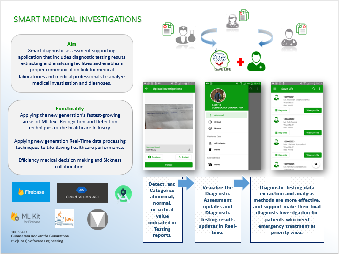
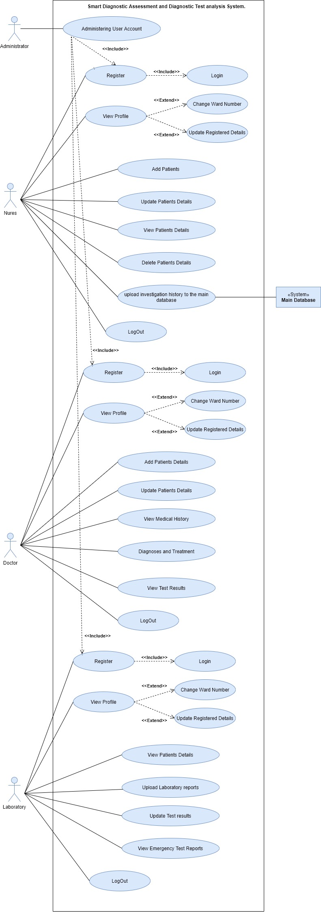
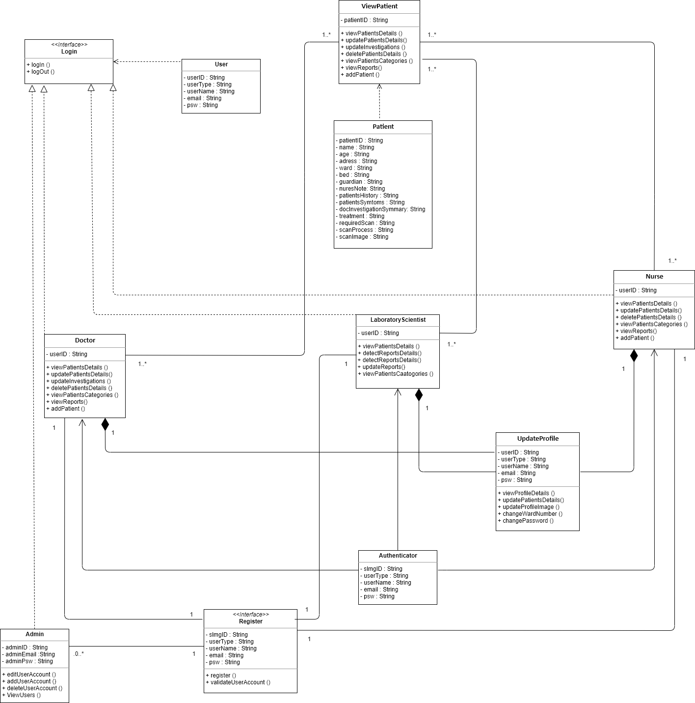
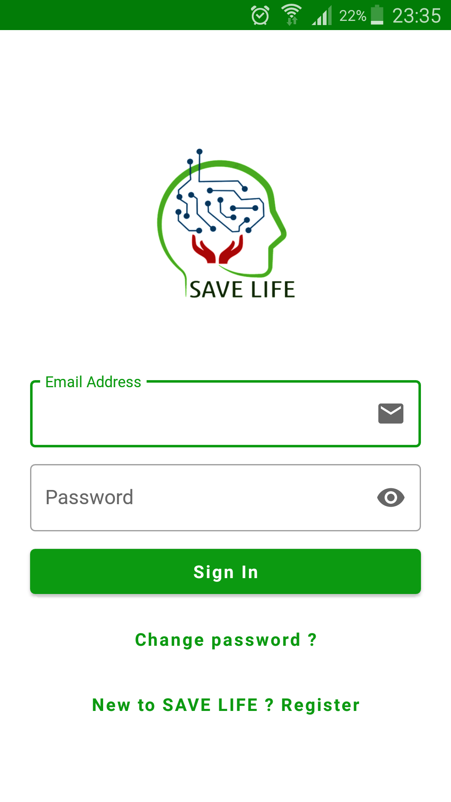
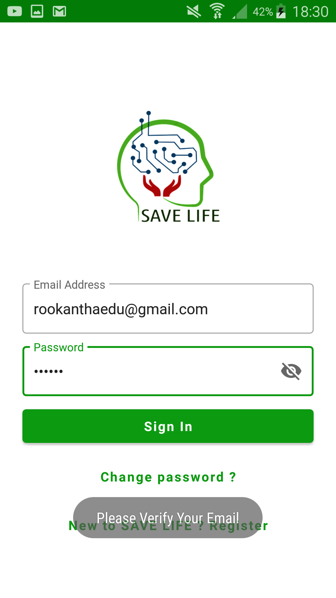
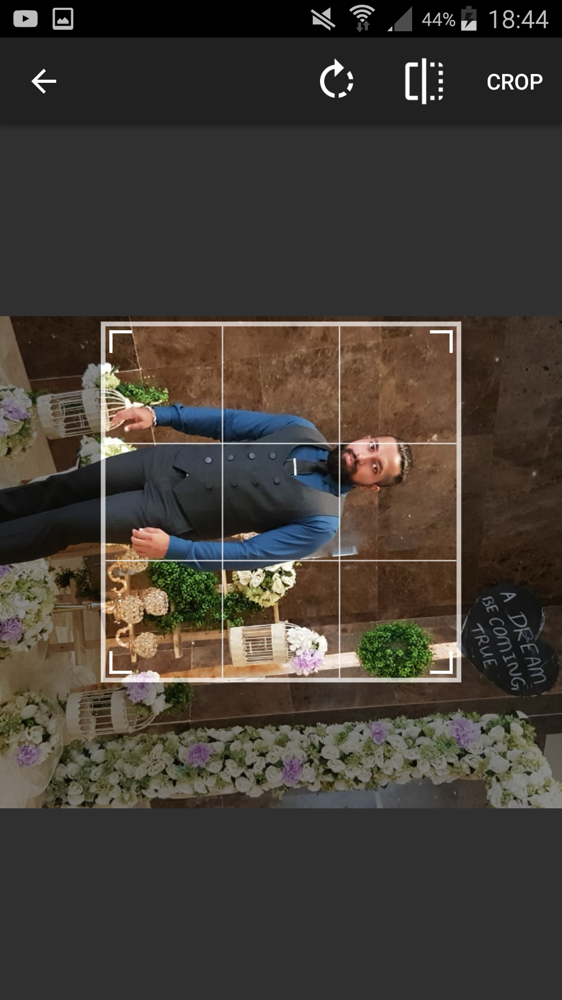
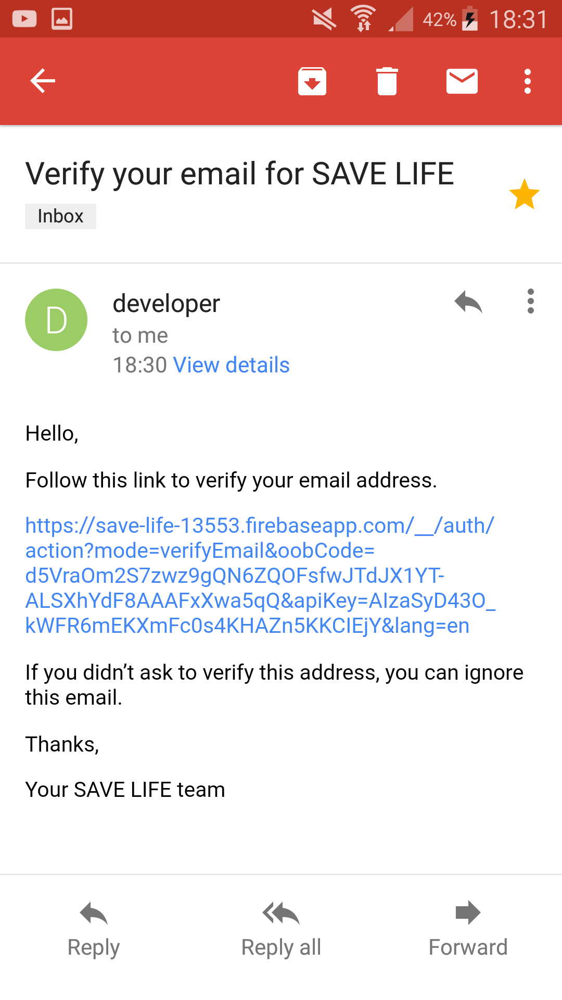
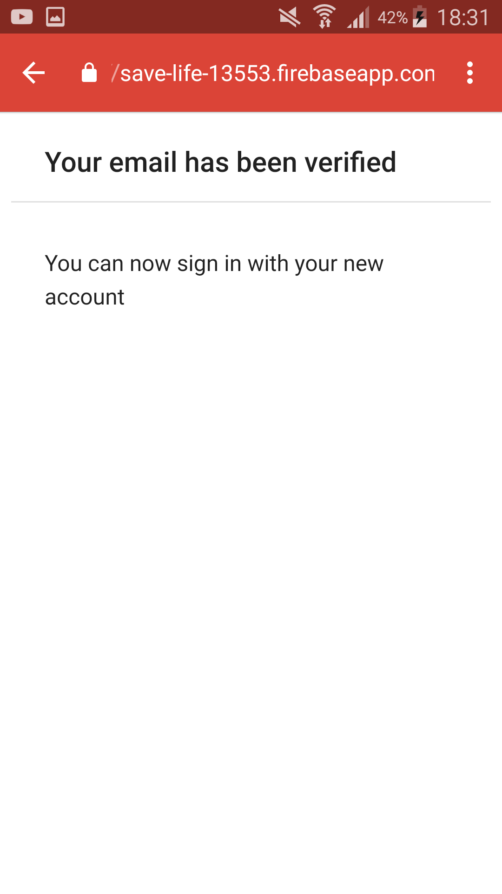
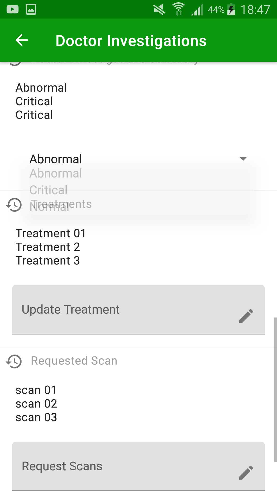

# Save-Life-Android
<h3>Smart Diagnostic Assessment and Diagnostic testing Application for the Healthcare industry - AI / IoT / Machine Learning / ML Text recognition and Detection / Vision API and OCR / Firebase / ML kit  / Android / Java </h3>

<h3>Abstract.</h3>

Usually, according to the principles and policies of the medical professionals, the diagnostic procedure needs to analyze diagnostic reports like full blood, etc. And needs to read several kinds of scan reports, etc... (Initial Diagnostic Assessment and Diagnostic Testing). Today, most fields of healthcare have faced a lack of efficiency issues because there is no proper communication link in medical laboratories and medical professionals to analytics medical problems and diagnosis according to investigation reports. Also need to improve the procedure of predict risks for illnesses and epidemics, take pro-active and precaution, investigate the nature of the illness, make decisions and sickness collaboration, efficient investigation procedure and develop exciting new techniques to treat diseases.

The aim of this mobile application is how to analyze patients' Diagnostic Reports and visualize patients' information in a proper way using Machine Learning text recognition, optical character recognition, Real-Time Data Manipulation, and text analytics techniques. The application is Integrated by the firebase database Authentication security policy and it will control data access. Text recognition and the text extraction process will be implemented by using Firebase Machine learning Kit’s text recognition APIs with High accuracy. The mobile application allows extract data from the investigation reports and inserts data into the firebase real-time database. Using the Firebase queries and filtering applications will automatically categorize data in who needs emergency treatment as priority wise.

Also, medical experts can monitor patients' updated investigations in real-time. Medical professionals can attend final investigations or required actions immediately Based on real-time updated data. 
Specifications of the specific medical area, medical professionals' communication capabilities, efficient real-time data manipulation, and healthcare prediction capabilities provide a platform for a new generation of Quality essential diagnostics and treatment options.

  
<h3>Behavioral diagrams: Use case</h3>

Use case diagram was created to the specifications that capture the overall functionality of the system at a very high-level using notations of actors, use cases, and relationships among them. This can often be used as a summary of all use cases in a system.
However, it is showing the high-level view of the functional requirements and how the Doctor, laboratory scientist and health care staff actors would interact.

  
<h3>Structural diagrams: Class Diagram. </h3>

The structural diagrams represent the static aspect of the system. These static aspects represent those parts of a diagram, which forms the main structure and are therefore stable.
During the design stage, the Class diagram was created to demonstrates the structure of a software system in terms of classes, attributes, operations, and the relations between them.

  
<h3>ER diagrams. </h3>

In the software design process Sketching out a plan before start building tables and connecting them with relationships in the database is always going to be a recommended best practice. This will help to design and identify potential challenges early on before they become major flaws in the database. ER diagrams visualize the relationships of entities stored in a database and technology is Used the concept of entities, relationships, and attributes.

  
<h3>Design principles and design patterns.</h3>

  <dl>
  <dt>Architectural design patterns</dt>
  <dd>In terms of software engineering does not start building a mobile application, or any other software system for that matter without a clear idea about its architecture. The lack of guiding principles results in cluttered code, and a tightly coupled system. Such a codebase is challenging to maintain and more prone to bugs. </dd>
  <dt>MVC</dt>
  <dd>Model-In this context, all the communication between databases, APIs, and validation processes are being taken place. Therefore, the model is invisible from outside     observations, it is an internal operation that compromises most of the heavy tasks.</dd>
  <dd>View-This illustrates the visible environment for the users, in this case, Doctors, nurses, and laboratory scientists.</dd>
  <dd>Controller-The controller involves coordination communication between model context and the view context. Therefore, no possible interruptions will occur during patents data transactions.</dd>
  <dt>GRASP patterns.</dt>
  <dd>GRASP design principle consists of nine major patterns, including controller, creator etc. These GRSPE patterns composed of an answer to a software design problem. I have used not all but some of GRASP design principles in project solution design.</dd>

<dt>HCI And Usability Engineering.</dt>
  <dd>The goals of applying HCI principles to design:
 <ul>
  <li>Safety </li>
  <li>Utility</li>
  <li>Effectiveness</li>
  <li>Usability</li>
</ul>
 
“UE is an approach to the development of software and systems which involve user participation from the outset and guarantees the usefulness of the product through the use of a usability specification and metrics" (Faulkner, 2000).
<ul>
  <li>Schneiderman’s eight golden rules.</li>
  <li>Norman’s Seven Principles. </li>
  <li>5.8.3	Nielsen’s Ten Heuristics.</li>
</ul>  
</dd>

<dt>Material Design</dt>
  <dd>Beginning with Android Five Lollipop, Google introduced a new design language known as Material Design. Material Design is a visual language uniting style, branding, interaction, and motion under a consistent set of principles both in Android and for web applications. 
  <ul>
  <li>Material metaphor.</li>
  <li>Grids, typography, and colors.</li>
  <li>Motion focuses.</li>
</ul>  
</dd>
</dl>

<h2>Methods of Approach and Project Management.</h2>

When developing software, change is unavoidable. Requirements change for a variety of reasons. When the technology used to build the software becomes obsolete it makes software development inherently risky and creates unplanned adjustments and affects continuous improvement. To manage these challenges, there is an outline of the methodology and implementation of the Rational Unified Process, Agile Approach, and PRINCE2 management that took place during the project.

  
<h3>PRINCE2.</h3>

PRINCE2 is a mature method developed through extensive consultation with project professionals. It provides a framework with guidance on what needs to be done and when, but without being prescriptive on how to do it. Also, we can achieve several benefits using PRINCE2 compatible with the project and the agile environment.

  <h5>PRINCE2 Principles / best practices and Project Specifications.</h5>
<dl>
  <dt>Continued business justification.</dt>
  <dd>Every project needs a good reason to start. If considering the project benefits do not stack up to the project Succeed, then why go ahead? Thus. A business case should exist in some format for the project proposal and Project initiation Document and there should be also the alignment of the project with the corporate objectives.  Also, important to recognize the project with justification to proceed, should review that the justification still exists during the project as things can change in the external environment.</dd>
  <dt>Learning from experience. </dt>
  <dd>Learning lessons from similar and past medical investigation-based projects were very useful for manage project Scope and project Aim.</dd>
  
  <dt>Managed by stages.</dt>
  <dd>In the Project initiation document’s Project Plan was defined by project stages, as the initiation stage and the seven Build stages. 
Furthermore, there was Included how many and how long management stages depend on a number of factors, like the size and the complexity of the project, or where the major control or major decision points will be, and also the level of risk associated (Project Management Artefacts) with the work.</dd>
  <dt>Focusing on products. </dt>
  <dd>PRINCE2 suggests that we focus our planning effort on what needs to be delivered and the quality it should meet rather than what we need to do. This helps with initial scope definition and reduces the risk of failure of the final product.</dd>
  <dt>Proposal.</dt>
  <dd>the project proposal was included problem identification, the project’s rationale, and any user expectations as well as the intended solution. </dd>
  <dt>PID. </dt>
  <dd>A Document providing a more Detailed on top of that in the project brief environment, including scope, business case, quality plans, and an assessment of potential risks</dd>
  <dt>Project Plan.</dt>
  <dd>The overall key activity of the intended schedule for each stage of the project include in each project artifact documents.  </dd>
  <dt>Risk Management.</dt>
  <dd>The risk management plan was included risk identification, assessment, mitigation, monitoring, and control descriptions. Moreover, it describes the description of brainstorm risks, characteristics of the risks, schedule, impact to scope, addressing risks and Qualitative analysis of risk, and responses of risks. The overall key activity of the intended risk plans for each stage of the project’s was included in each project artifact documents.   </dd>
  
<dt>Quality Management</dt>
  <dd>The overall key activity of the intended Quality plans for each stage of the project’s was included in each project artifact documents. Also, includes Quality Planning, Quality Assurance, Quality Control, Verification & Validation are containing the Quality management plan.</dd>
  <dt>End of stage reviews </dt>
  <dd>According to agile and Rational unified process Implemented through ‘End of Stage Discussions' at the end of each stage in this report.</dd>
</dl>

<h3>Trello</h3>

The Trello simple web-based tool and Agile is a natural fit lightweight way for project development. Also, Agile and Trello have the flexibility to be applied in many ways.

<h3>Version control and GitHub</h3>

The version control system used in this project was GitHub. Using Git as a source code management tool has become an essential skill for all developers. Git helps manage the code in new features when developing a project. Also helps to find and fix problems and simplifies collaboration with other developers where are they around the world. Furthermore, the repository is stored on GitHub and not just kept locally, this prevents data from being lost in the event of local hardware failure.

  
<h3>Rational Unified Process.</h3>

An initial plan was drafted up during the early stages of the project. Rational Unified Process (RUP) was an attempt to come up with a comprehensive iterative software development process. RUP is essentially a large pool of knowledge. RUP consists of artifacts, processes, templates, phrases, and disciplines. It has detailed documentation, guidelines, sample artifacts, and deliverables. RUP is defined to be a customizable process that would work for building small, medium, and large software systems and process can customize Which called plugins. Also, RUP was greatly influenced by object-oriented analysis and design, and UML. RUP has four phases: Inception, elaboration, construction, and transition. 

According to the Rational Unified Process (RUP) guidelines, each phase has one or more iterations. Each RUP phase ends with a milestone and at the end of the inception phase, it can achieve the Lifecycle Objectives Milestone. Furthermore, the initial plan has considered Iteration Length and Timeboxing. That makes revisit existing software and improve it.

<h5>Iterative and Incremental software Development benefits. </h5> 
  <ul>
  <li>Early mitigation of high-risk based on Iteration length and timeboxing.</li>
  <li>Handle evolving requirements.</li>
  <li>Ensuring visible progress.</li>
  <li>Early feedback</li>
  <li>To Manage complexity</li>
  <li>Short and simple steps</li>
  <li>Methodological improvements in the development process.</li>
  <li>Series of steps to ensuring quality is built into the software.</li>
  <li>Get a robust architecture.</li>
</ul>

<h3>The Agile</h3>
<h5>Agile to the Reuse.</h5>

In Agile, the software has built iteratively and in small increments. Each step involves requirements capture, refinement, software analysis, and design, building code, unit integration, and system testing, deployment, maintenance, and bug fixes. At the end of each Sprint, a usable software product will be produced. It enables address risks and uncertainties associated with software development at each stage of the process. (Montoya, 2018).

  
<h3>Scrum framework.</h3>

The most popular Agile framework is called Scrum. The Scrum framework facilitates the development of complex products. Based on the evaluation, Scrum helps build products with evolving requirements, which makes it very effective for developing software.

  
<h3>Sprint</h3>

In Scrum, software products will build in an iterative and incremental software development. Each timebox iteration of work is called a sprint. The sprint is often described as the container event for all other Scrum events.

Each sprint starts with an event called sprint planning and each sprint ends with two events, the sprint review and sprint retrospective. This entire iteration cycle is called the sprint. This cycle continuously repeats as the Scrum builds a product. Each sprint must end with a potentially releasable product increment.

<h3>Kanban principles and core practices.</h3>

Kanban is a set of practices and principles that can be applied to an existing development process. It can be applied piecemeal which is called a shallow application or all out. Kanban is more than just keep track of the tasks and displaying the work. It is a way to organize the work for delivering the greatest valuable software product.

The chosen Kanban tool for this project was Trello and Trello bord including a list of development tasks, can be found at the beginning of each development stage in this report.

<h3>Tools and Technologies.</h3>

The project was focused on how the flowing technologies can effectively be used in the fields of healthcare, medicine, and public health.

<h3>Applying AI and IoT to Medicine and Healthcare.</h3>

AI is one of the most trending technologies which has inspired by journalists, writers, academics, and computer scientists presently. It has opened the door to large grants that early computer scientists used to build out a whole new area of research. AI as technology is any system that exhibits behavior that could be interpreted as human intelligence. There are many different forms of human intelligence.

This is seen as intelligent behavior, only because computers can be so much better than any human in identifying and matching different patterns. Based on that AI can be effectively used in the fields of healthcare and medicine.

For example, researchers in Denmark developed an AI assistant that listens on the phone to breathing patterns, tones of voice, and background noises during emergency calls to help diagnose heart attacks, with up to 95% accuracy, allowing them to get people the help they need more quickly.

IEEE defines the Internet of Things as a network that connects uniquely identifiable things to the internet. As per the project domain, millions of devices are using in the healthcare system to help patients, like monitoring systems, tracking sensors, and smart healthcare apps.

  
<h3>Machine Learning</h3>

ML has been around for a long time. Early AI researchers started to wonder if instead of planning out matching patterns, a computer could be programmed to learn the new patterns by itself. This is the beginning of the ML.

<h3>ML Text recognition and Detection.</h3>

Text recognition and detection are referred to as the process of deriving information from the text. Text recognition and analytics are one of the fastest-growing areas in the field of machine learning. There is a great reason for this. More and more data generated today is free text.

For example:

The Internet contains several blogs, reviews, comments, notes, and other text-based facts including Social media.

With so much free text data out there, businesses can capitalize through text detection and text analytics. They can then use these insights to strategize business actions, but analyzing text poses us various unique challenges. Text data is several times as large as numeric data. Also, the text does not have a fixed structure or schema and that makes understanding it very difficult.

  
<h3>Vision API and OCR.</h3>

Google’s Cloud Vision is built on powerful computer vision models that power several Google services. Google’s AI and machine learning products are divided into several components. One of them the AI building blocks are made up of two further components, pre-trained models, and custom models. Pretrained models are further broken down into sight, language, structured data, and conversation. Google Cloud Vision API based on these pre-trained models and allows models to label images and to detect certain aspects of those images that Google has made available from their own models and training datasets (Google, n.d.).

Text detection and document text detection annotation features are supported to optical character recognition (OCR).

<h3>Firebase.</h3>

Firebase is a cloud service platform that can be accessed through its SDK. Functionality ranges from authentication, Realtime Database functionality, and analytics to cloud messaging storage, ads, and much more. (Google, n.d.). (Firebase, n.d.).

Using firebase over other systems are as follows:

<h3>ML kit Mobile Software Development kit.</h3>

ML Kit mobile SDK brings Google's ML technologies to Android and IOS software application. General-purpose of APIs introduced software features such as text recognition, face recognition, barcode scanning, image labeling, and landmark recognition, etc.

The project overarching goal is to Extract medical test information into text for an actionable analyzed data, via application Firebase ML kit text detection methods. High-quality information is typically derived through the devising of patterns and trends through means such as statistical pattern learning. In that case, Detecting and turning medical diagnosis tests into actionable information and finding sensitive data in diagnostic testing has various unique challenges (Google, n.d.).

<h3>Firebase Authentication.</h3>

There are two main ways provided by Firebase to do user authentication, with and without the provided user interface. Firebase UI authentication provides for the user to login and creates accounts using the email and password, Google account, Facebook, Twitter, and by their phone to receive a text to respond to. These are each federated which means they can be supported together or separately (Google, n.d.).

<h3>Realtime Database and Data structure.</h3>

The Realtime Database module gives access to a cloud-hosted NoSQL database.

Unlike SQL databases that use a relational data structure, The Realtime Database stores all its objects as JSON objects. The JSON Objects tree structure has a series of nodes and in those nodes save the information by keys. The Realtime Database functionality has security roles that can be configured in the console for greater privacy.

  
<h3>Cloud Storage.</h3>

Firebase's cloud storage great place to store any files that users create or generated by the app. It also provides Integration, Variation functionalities for application.
Firebase storage reference was used to create the files and upload them to the server and related reference was used to the data in the real-time database to fetch them again later.

<h3>Android.</h3>

Android includes the operating system, which is based on Linux, but it is specifically designed to be run on mobile devices, including cell phones and tablets.

Android SDK is a framework that lets run apps on mobile devices, such as phones and tablets, and now even on Chromebook computers and can build apps using Android Wear for watches, Android TV for television, etc. Also, the compiler allows build and package the apps for distribution.

<h3>Programming for Android with Java.</h3>

Java is class-based, allowing for an inheritance to be achieved by defining classes. Java is an object-oriented programming language, which can create data structures that contain data known as attributes.java is platform-independent that specifically designed to have as few implementation dependencies as possible.

Java is considered an application programming language, and it is widely used in the industry.

The Android app framework works around the Java programming language and specifically starting with Java 7, Android uses a customized version of open JDK, an open-source implementation of Java from Oracle. Does not all Java APIs are implemented in the Android SDK. Many of Java's standard APIs are implemented in the Android SDK and Android SDK also includes many custom APIs.

  
<h3>Conclusion.</h3>

This project set out to research the importance of build-up proper communication to Diagnostic assessment and testing in public healthcare, especially in the low and middle-class countries. That is enables efficient essential medical service collaboration between medical professionals. also, application eliminates human errors and time wastage 
paper-based processes and improves the Quality of patient care by avoiding the critical condition of patients.

The project has recognized the challenges and possibilities of diagnosis by utilized tools and technologies, it opens the doors to future research directions.
In the conclusion, to obtain great opportunity and encouragement to creates efficient and effective applications for secure billions of lives in the world according to the concept of "think out of the box" is one of the victories from this application.

  
<h2>Screen Shots</h2>

Start Page & Login

  

Register 

  

  

  

Image Rotaion

  

  

  

  
  

  
  

  
  

  
  
  

  
  

    
  
  

Start Page

  
  
  

